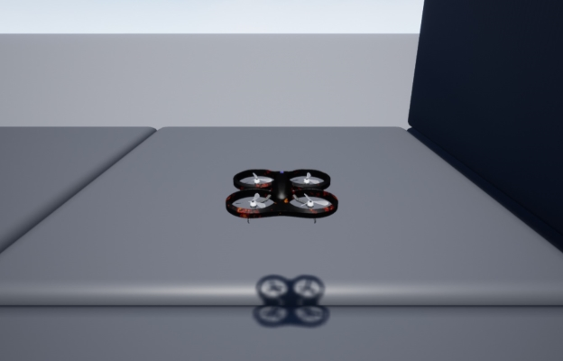

# Welcome to Project AirSim

Project AirSim is a simulation platform for drones, robots, and other autonomous systems.

Building on the previous work of **[AirSim](https://github.com/microsoft/AirSim)**, it leverages **[Unreal Engine 5](https://www.unrealengine.com/)** to provide photo-realistic visuals, while providing the simulation framework needed to integrate custom physics, controllers, actuators, and sensors to develop an autonomous system.

Project AirSim consists of three main layers:

1. **Project AirSim Sim Libs** - Base infrastructure for defining a generic robot structure and simulation scene tick loop

2. **Project AirSim Plugin** - Host package (currently an Unreal Plugin) that builds on the sim libs to connect external components (controller, physics, rendering) at runtime that are specific to each configured robot-type scenario (ex. quadrotor drones)

3. **Project AirSim Client Library** - End-user library to enable API calls to interact with the robot and simulation over a network connection

For more details on the architecture, see **[Project AirSim Architecture Overview](docs/development/use_source.md#airsim-v-next-architecture-overview)**.

Project AirSim currently supports Windows 11 and Ubuntu 22. For more info about hardware specs for working with Project AirSim, see **[System Specifications](docs/system_specs.md)**.



## Open Source Commitment

We believe that open-source is the best way to foster innovation and collaboration in robotics simulation. Project AirSim can only thrive if it's built together — not by a single corporation, but by all of us.

We invite you to become part of this journey: contribute code, share feedback, report issues, and help shape the future of the platform.

## Enterprise Support

IAMAI Simulations offers professional **Enterprise Support** for teams and organizations building on Project AirSim.

Whether you're working on large-scale simulations, custom features, or integration into your existing stack, we can help you move faster and with confidence.

**To learn more, visit [iamaisim.com](https://www.iamaisim.com).**

## Support the Project

Running and maintaining a project of this size has significant infrastructure and development costs. We are not Microsoft — we are a focused, passionate team. If you or your organization is benefiting from Project AirSim, please consider becoming a sponsor.

Your support helps us:

- Host and distribute binary releases  
- Improve developer documentation and onboarding  
- Offer community support and mentorship  
- Push the platform forward with new features

**To become a sponsor or partner, tap on the Sponsor button**


## Join the Community

We believe that collaboration is key to building a thriving ecosystem around Project AirSim. Join our growing community to share ideas, ask questions, and collaborate with other developers and enthusiasts:

- **Discord**: Connect with us on our official Discord server for real-time discussions, support, and updates. [Join here](https://discord.gg/XprQ2w64uj).
- **GitHub Discussions**: Participate in discussions, share feedback, and contribute to shaping the future of Project AirSim. [Start a discussion](https://github.com/iamaisim/ProjectAirSim/discussions).

We look forward to hearing from you and building the future of autonomous systems together!


## What's New

For a complete list of changes, view our **[Changelog](docs/changelog.md)**.

## Roadmap and Collaboration

Our project's roadmap and future direction are defined through GitHub issues and discussions. Issues or discussions labeled **roadmap** or **need help** outline planned features and areas where community contributions are encouraged. We invite you to participate and help shape the future of Project AirSim.

## Getting Started

See **[Installing system prerequisites](docs/system_specs.md#installing-system-prerequisites)** for information about Windows/Linux system setup needed before running Project AirSim.

### 1. Develop with Project AirSim source

> I'm going to build the sim libs, Plugin, Blocks, and my own UE project environment from the ground up so I can customize it to my application.

*Note:* You can either build Project AirSim from source or download pre-built binaries to use with the Python client. Currently, only the classic Blocks environment is available. If you require another environment (e.g., urban, geo-specific, etc.), you can sponsor its maintenance by contacting [info@iamaisim.com](mailto:info@iamaisim.com).

#### **[Use pre-built binary environments](docs/development/use_prebuilt.md)**

### 2. Develop with Project AirSim source

> I'm going to build the sim libs, Plugin, Blocks, and my own UE project environment from the ground up so I can customize it to my application.

#### **[Build from source as a developer](docs/development/use_source.md)**

## Running Headless (Docker)

If you need to run a Project AirSim simulation on a headless system, such as in a Docker container, you can enable off-screen rendering by adding the `-RenderOffScreen` argument when launching the Unreal environment executable:

```
Blocks{.exe/.sh} -RenderOffScreen
```

If you are running without GPU access and want to run without any image rendering, you can disable rendering completely by adding the `-nullrhi` argument:

```
Blocks{.exe/.sh} -nullrhi
```

These arguments can also be used while debugging in VS Code by modifying the `launch.json` file, or in Visual Studio 2022 by modifying the project's `Configuration Properties`. See **[Running Headless (Docker, Azure Cloud)](docs/development/headless_cloud.md)** for more details.

## Reference

### Configuration JSONC Settings

- **[Overview](docs/config.md)**
- **[Scene Settings](docs/config_scene.md)**
- **[Robot Settings](docs/config_robot.md)**

### Client API

- **[Overall API Info](docs/api.md)**

### ROS Integration

- **[ROS Bridge Setup and Use](docs/ros/ros.md)**
- **[ROS Bridge Examples](docs/ros/ros_examples.md)**

### Controllers

- **[Flight Controllers](docs/controllers/controllers.md)**
- **[Simple Flight Controller](docs/controllers/simple_flight.md)**
- **[PX4 Flight Controller](docs/controllers/px4/px4.md)**

### Sensors

- Airspeed
- Barometer
- **[Camera](docs/sensors/camera_capture_settings.md)**
- Distance
- GPS
- IMU
- **[Lidar](docs/sensors/lidar.md)**
- Magnetometer
- **[Radar](docs/sensors/radar.md)**

### Scene

- **[Simulation Clock](docs/scene/sim_clock.md)**
- Coordinate System
- **[Weather Visual Effects](docs/scene/weather_visual_effects.md)**

### Physics

- **[Fast Physics](docs/physics/fast_physics.md)**
- **[Matlab Physics](docs/physics/matlab_physics.md)**

### Autonomy Blocks

- **[Autonomy Building-Blocks](docs/autonomy/autonomy.md)**
- **[Autonomy Gym](docs/autonomy/gym/gym_envs.md)**

## FAQ

If you run into problems, check the **[FAQ](docs/faq.md)** for help.

## Transitioning from AirSim

See **[Transitioning from AirSim](docs/transition_from_airsim.md)** for guidance on converting an AirSim Unreal environment and client code from AirSim to Project AirSim.

## License

Please see the [License page](docs/license.md) for Project AirSim license information.

---

Copyright (C) Microsoft Corporation. 
Copyright (C) IAMAI Consulting Corp.  

MIT License. All rights reserved.
