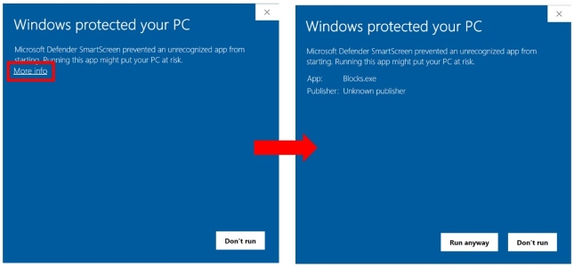

# Using Pre-built Binary Environments

The quickest way to jump in and see what Project AirSim can do is to download and run a pre-built binary environment.

## Package contents

Here is an example of the SoccerField environment package contents:

```
SoccerField_{Win64|Linux64}
  └─ {WindowsNoEditor|LinuxNoEditor}
    └─ Engine
    └─ SoccerField
    │  └─ Binaries
    │  └─ Content
    │  └─ ProjectAirSimConfig
    |  |    scene_basic_drone.jsonc
    |  |    robot_quadrotor_fastphysics.jsonc
    │  │    ...
    │  └─ Saved
    └─ SoccerField{.exe|.sh}
```

The two key areas in the package are:
1. The executable file to launch the environment (ex. `SoccerField.sh`)
2. The `ProjectAirSimConfig` folder that contains the JSON simulator config files

## How to launch the environment

To run the environment, just launch the `.exe` file for Windows or run the `.sh` script for Linux.

*Note: If you see a blue Windows SmartScreen Filter prompt on launch with a big **Don't run** button, click the **More info** text link to expose the **Run anyway** button to allow the executable to launch.*



The simulation will start with an empty Blocks environment without any vehicles.

To configure the environment and add vehicles to the simulation, a client must connect to Project AirSim and create a world by passing a description of the world as a string of JSON-formatted data.  For example, the sample Python client script `projectairsim_client\ProjectAirSim_Example_User_Scripts\hello_drone.py` does the following:

``` Python
from projectairsim import ProjectAirSimClient, World
...
client = ProjectAirSimClient()
world = World(client, "scene_basic_drone.jsonc")
```

The Project AirSim Python client API library loads the JSONC (JSON with Comments) string from the scene configuration file `projectairsim_client\ProjectAirSim_Example_User_Scripts\sim_config\scene_basic_drone.jsonc`.  The scene configuration file specifies a single robot with a reference to the robot configuration file `robot_quadrotor_fastphysics.json` which resides in the same directory as the scene configuration file.  The contents of the files are assembled into a single string of JSON-formatted data and sent to Project AirSim.  Project AirSim then constructs the specified environment and robot(s).

A set of example JSONC configuration files are provided so that the simulation can be launched out-of-the-box. If you wish to customize the configuration, please see **[Configuration Settings](../config.md)** for more details.


> How can I move the spawn location?

The robot can be spawned in another place by simply changing the `origin`: `xyz` coordinate in `scene_basic_drone.json`. For example, changing it to the values below will spawn the drone over by the soccer goal 18 m forward and 22 m to the right:

``` json
"origin": {
  "xyz": "18.0 22.0 -10.0",
  "rpy-deg": "0 0 0"
},
```


## How to interact with the drone

*To manually fly the drone, keyboard input commands will be added in the future.*

To send control commands or get sensor data from the drone, a Python client is provided.

To set up the Python client, see **[Project AirSim Client Setup](../client_setup.md)**.

There are some example client scripts already provided, so to start you can just run:
```
python hello_drone.py
```

This script will connect to the simulation and send commands for the `Drone1` quadrotor to take off and then land. During the flight, the client should receive downward-facing **RGB camera images** and **depth camera images** as OpenCV image pop-up windows.

After the script ends, the drone will continue to wait for further client connections. To end the simulation, just close the the environment application window.

## How to add multiple drones

You can also add more drones to the scene. See **[Multiple Robots in a Simulation](../multiple_robots.md)** for more details.

## How to modify the drone

There are many parameters of the drone's configuration that can be modified in the **[Robot Configuration Settings](../config_robot.md)** so the physical behavior of the drone can be customized at run-time even for a pre-built binary environment.

However, the visual meshes used for the robot links can only be chosen based on content that was included during the environment packaging.

To be able to use new meshes and fully customize the drone and environment, see **[Using Project AirSim Plugin in Custom Environments](../use_plugin.md)**.

---

Copyright (C) Microsoft Corporation.  
Copyright (C) 2025 IAMAI Consulting Corp.

MIT License. All rights reserved.
