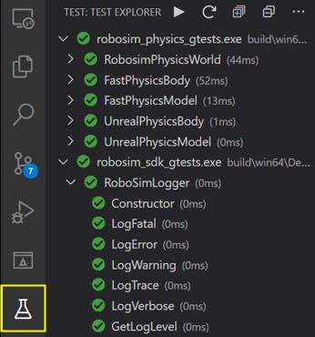
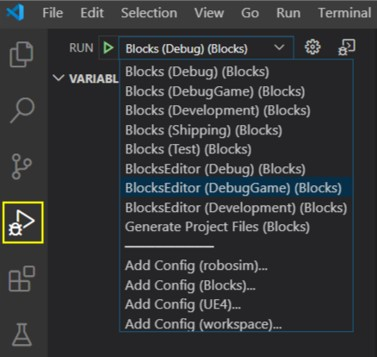
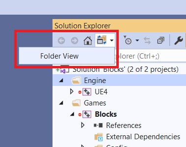
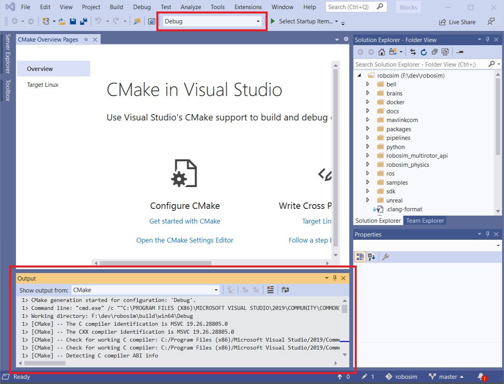
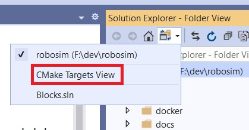
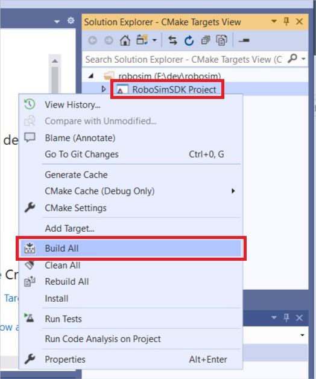

# Build From Source as a Developer

For many usage scenarios, **[Using Pre-built Binary Environments](use_prebuilt.md)** or **[Using Project AirSim Plugin in Custom Environments](../use_plugin.md)** is enough to get a simulation up and running. The main development would then be done by setting up the **[Config JSON Settings](../config.md)** and using the **[Project AirSim Client](../client_setup.md)** and **[APIs](../api.md)** to drive the simulation for the particular usage application.

If deeper customization or extending new features is needed, building the Project AirSim framework from source can be done through the process described below.

---

## Project AirSim architecture overview

There are 3 layers to the Project AirSim development process:

1. **Project AirSim Sim Libs** - `projectairsim/` root CMake project
2. **Project AirSim Plugin** - `projectairsim/unreal/Blocks` script-generated project requiring Unreal Engine
3. **Project AirSim Client Library** - `projectairsim/client/python` Python client files

<*TODO Add high-level architecture diagram here.*>

Key parts of the Project AirSim folder structure:

```
projectairsim
  └─ ...
  └─ client               (Client files)
  │  └─ python              (Python client files)
  │     └─ projectairsim       (Project AirSim Client Library)
  │     └─ sim-config         (Project AirSim config JSONC files)
  └─ multirotor_api       (Project AirSim component for multirotor controllers)
  └─ physics              (Project AirSim component for physics)
  └─ core_sim                  (Project AirSim core sim)
  └─ unreal
     └─ Blocks              (Blocks Unreal environment)
        └─ Plugins
           └─ ProjectAirSim     (Project AirSim Plugin)
           └─ Drone           (Drone content-only plugin)
```

---

## Initial developer setup

Project AirSim can be developed using Windows 11 or Ubuntu 22.04 Linux. See **[System Specifications](../system_specs.md)** for more details.

For details on getting your dev environment set up, choose your platform:
- **[Developer Initial Setup for Windows](dev_setup_win.md)**
- **[Developer Initial Setup for Linux](dev_setup_linux.md)**

---

## Developing Project AirSim Sim Libs

Choose your development tool:

- **[Command Line (Windows/Linux)](#command-line-(windows/linux))**
- **[VS Code (Windows/Linux)](#vs-code-(windows/linux))**
- **[Visual Studio 2019 (Windows only)](#visual-studio-2019-(windows-only))**

**Note:** Project AirSim sim libs uses CMake which saves build configuration information in a cache, so **if you switch tools** between using command line, VS Code, or Visual Studio 2019 to drive the CMake project in the same folder, you should **clear the cache** by running `build clean` so the next tool can reset the configuration and build again properly.

---

## Command Line (Windows/Linux)

On Windows, run the `build.cmd` script using the `x64 Native Tools Command Prompt for VS 2019`. On Linux, run the `build.sh` shell script.

`build{.cmd|.sh} {target from below}`

```
all = Clean + Build + Test + Package everything
clean = Clean sim libs + Blocks build files

simlibs_debug = Build + Package sim libs for Debug
simlibs_release = Build + Package sim libs for Release
test_simlibs_debug = Test sim libs for Debug
test_simlibs_release = Test sim libs for Release

blocks_debuggame = Build Plugin + Blocks for DebugGame (uses Debug sim libs)
blocks_development = Build Plugin + Blocks for Development (uses Release sim libs)

package_plugin = Package Project AirSim UE Plugin for Debug + Release
package_blocks_debuggame = Package stand-alone Blocks environment executable for DebugGame
package_blocks_development = Package stand-alone Blocks environment executable for Development
```

The sim lib components and unit test executables are built in the `projectairsim/build/` folder using CMake, and are automatically copied to the Unreal Blocks environment folder to be ready for building the plugin.

The Plugin components are built in the `projectairsim/unreal/Blocks/` folder using the Unreal Engine's build system.

The packaged outputs (sim lib components, UE Plugin, Blocks stand-alone executable) are copied to the `projectairsim/packages/` folder, where they can be picked up for external uses.

The Python client files are in the `projectairsim/client/python/` folder, with the Project AirSim Client Library in the `projectairsim/client/python/projectairsim` sub-folder.

---

## VS Code (Windows/Linux)

Although the sim libs CMake project can be opened as a folder in VS Code independently of the Blocks Unreal environment project, it is more convenient to develop the sim libs together with the UE Plugin in the Blocks environment as a multi-root workspace project which has access to all levels of source during debugging.

To develop using a multi-root workspace project file, follow the steps below:

1. **Generate and open the VS Code `Blocks.code-workspace` project file**

    Run the following script:

    ```
    projectairsim/unreal/Blocks/blocks_genprojfiles_vscode{.bat|.sh}
    ```

    Since some parts of the sim libs haven't been built yet, there may be some warning outputs in yellow text, but it is ok to ignore them.

    After it completes, use VS Code to open the `projectairsim/unreal/Blocks/Blocks.code-workspace` that was generated.

2. **Choose CMake Kit toolchain for building sim libs**

    After the workspace opens and tap on the CMake extension to configure it:

    

    Select the **CMake Kit** section and choose `Visual Studio Enterprise 2022 Release - amd64` for Windows or `Clang 10.0.0` for Linux. If no kits are shown, select `Scan for kits` to refresh the detected toolchains.


3. **Choose CMake build configuration for sim libs**

    Select the **CMake Config** section and choose the desired sim libs build configuration for your platform:

    

    When you select a build config, it will trigger CMake to run its configuration step to generate the cache for setting up the build. The first time this is run for each config, it may take a few minutes because it fetches the sim libs' dependencies from their repos.

4. **Choose Intellisense configuration**

    The active Intellisense configuration is shown at the right side of the bottom toolbar:

    

    The Intellisense configuration will switch based on which part of the multi-root workspace the last active source file is from.

    When a sim lib source file is active, you can click on the **Intellisense Config** button to select the appropriate config for your platform (defined in `projectairsim/.vscode/c_cpp_properties.json`):

    

    When a Blocks Plugin source file is active, it will use Unreal's automatically generated configuration called `UnrealEngine` (defined in `projectairsim/unreal/Blocks/.vscode/c_cpp_properties.json`).

    **Caution:** If you modify the `UnrealEngine` settings, it will get overwritten whenever the `blocks_genprojfiles_...` scripts are run to regenerate the workspace.

5. **Build sim libs using the CMake `[all]` target**

    Click the **Cmake Build** button in the bottom toolbar to trigger the CMake build of the sim libs for the selected configuration. You should see the results of the build in the `Output` console's `CMake/Build` section.

    

    **Note:** There is no toolbar button to trigger a `clean` build, so if something goes wrong, you can use the **command line** build scripts to run `build clean`, and then retry configuring/building the CMake project.

6. **Run CTest unit tests for sim libs**

    After the sim libs have been built, a **CTest Button** should appear in the bottom toolbar. Clicking this CTest button will trigger CTest to run the unit test executables for the current build configuration.

    

    You can also run and debug the unit tests from the Test Explorer sidebar section:

    

7. **Launch the main debugger with the sim libs' matching Unreal Editor configuration**

    Once the sim libs have been built, you can switch to the **Run Debugger** sidebar section and choose a debug target from the drop-down menu:

    

    The targets shown are automatically generated in the `launch.json` file by Unreal when the `blocks_genprojfiles_...` script generated the workspace. However, some of the targets are not valid.

    The valid targets for primary development are:

    - Blocks (DebugGame)
    - Blocks (Development)
    - BlocksEditor (DebugGame)
    - BlocksEditor (Development)

    The `BlocksEditor` targets can be launched as long as the corresponding sim libs configuration has been built (`DebugGame` requires `Debug` sim libs, and `Development` requires `Release` sim libs).

    The stand-alone game `Blocks` targets can't be launched until the game content has been **[cooked](https://docs.unrealengine.com/en-US/Engine/Deployment/Cooking/index.html)**, as described in the next optional step.

    To start, just click the green **Run** button to launch the `BlocksEditor` target and after building the Plugin and Blocks environement, the Unreal Editor should load up ready to Play and debug.

    When you click on the **Play** button in the Editor toolbar, a drone should spawn and the simulation has started running, ready for a client to connect to it.

    

8. ***(Optional)* Cook stand-alone game content**

    One way to cook the game content is to first launch the Editor target and then in the Editor GUI select `File -> Cook Content for {Windows|Linux}`.

    Another way to cook the game content is to use the **command line** build script to package the Blocks stand-alone game:

    ```
    build.{cmd|sh} package_blocks_{debuggame|development}
    ```

    It can be cooked with either DebugGame or Development configurations, as the cooked content is the same for both.

9. ***(Optional)* Launch the main debugger with the sim libs' matching stand-alone game configuration**

    Once the game content has been cooked, you can use the stand-alone game `Blocks` targets to launch the VS Code debugger.

    Sometimes this is faster to use than the `BlocksEditor` targets for development iteration because it doesn't load all of the Editor overhead on each launch. However, the Editor can be convenient for repeatedly starting/stopping play of the simulation while debugging the same build.

10. **See **[Developing Project AirSim Client Library](#developing-projectairsim-client-library)** for the next steps of interacting with the Blocks simulation through the Python client.**

---

## Visual Studio 2019 (Windows only)

Due to Project AirSim's multi-layer project architecture that combines CMake for the sim libs and Unreal's build system for the Plugin, there are some quirks to using Visual Studio 2019 to manage both systems.

One option is to simply use the **command line** build scripts to manage the CMake side for sim libs, and only use the Visual Studio solution to drive the Unreal Plugin and environment.

However, it is possible to use Visual Studio to do both in a single project by following the steps below.

1. **Generate and open the Visual Studio 2019 `Blocks.sln` solution project file**

    Run the following script:

    ```
    projectairsim/unreal/Blocks/blocks_genprojfiles_vs2019.bat
    ```

    Since some parts of the sim libs haven't been built yet, there may be some warning outputs in yellow text, but it is ok to ignore them.

    After it completes, use Visual Studio 2019 to open the `projectairsim/unreal/Blocks/Blocks.sln` that was generated.

2. **Switch to the Solution Explorer's folder tree view**

    The solution will load with everything set up for launching the Blocks Unreal environment, but first the sim libs needs to be built with CMake.

    To switch to the CMake side of the project, choose the Solution Explorer's `Folder View` for Visual Studio to detect the CMake files in the root `projectairsim` folder.

    

3. **Wait for CMake root project to be detected**

    After a minute or two, the CMake project should be automatically detected and the `Output` console will start to show CMake running its configure step for the default build configuration. The build configuration drop-down menu should also show up in the top toolbar for switching the active config from the default `Debug` config.

    

4. **Switch to CMake Targets view and choose CMake build configuration for sim libs**

    The Solution Explorer should now have a `CMake Targets View` option in addition to the `Folder View` and `Blocks.sln` solution.

    

    Switch to the `CMake Targets View` and choose the desired build configuration from the toolbar drop-down menu. CMake will re-configure when the build configuration is changed. After CMake's configure step is finished, the `CMake Targets View` will become a list of the CMake project targets that are available to build.

5. **Build sim libs with CMake**

    In the `CMake Targets View`, right-click on the `ProjectAirSimSimLibs Project` and select `Build All`. The `Output` console should start to display the build steps as all of the sim libs components are built.

    

6. **Run CTest unit tests for sim libs**

    After the build completes, you can run the sim lib unit tests by CTest by right-clicking on the `ProjectAirSimSimLibs Project` and selecting `Run Tests`. The test results will be displayed in the `Output` console.

    You can also run and debug the unit tests from Visual Studio's Test Explorer section that can be activated from the `Test` menu.

7. **Switch to Blocks Solution view to launch debugger with matching Unreal configuration**

    Once the sim libs have been built, you can switch to the Solution Explorer's `Blocks.sln` solution view and choose a debug target from the drop-down menu:

    

    The `DebugGame Editor` and `Development Editor` targets can be launched as long as the corresponding sim libs configuration has been built (`DebugGame` requires `Debug` sim libs, and `Development` requires `Release` sim libs).

    The stand-alone game `DebugGame` and `Development` targets can't be launched until the game content has been **[cooked](https://docs.unrealengine.com/en-US/Engine/Deployment/Cooking/index.html)**, as described in the next optional step.

    Project AirSim only supports the `Win64` option, which should be selected by default.

    To start, just click the green **Local Windows Debugger** button to launch the `DebugGame Editor` or `Development Editor` target and after building the Plugin and Blocks environement, the Unreal Editor should load up ready to Play and debug.

    When you click on the **Play** button in the Editor toolbar, a drone should spawn and the simulation has started running, ready for a client to connect to it.

    

8. ***(Optional)* Cook stand-alone game content**

    One way to cook the game content is to first launch the Editor target and then in the Editor GUI select `File -> Cook Content for Windows`.

    Another way to cook the game content is to use the **command line** build script to package the Blocks stand-alone game:

    ```
    build package_blocks_{debuggame|development}
    ```

    It can be cooked with either DebugGame or Development configurations, as the cooked content is the same for both.

9. ***(Optional)* Launch the main debugger with the sim libs' matching stand-alone game configuration**

    Once the game content has been cooked, you can use the stand-alone game `DebugGame` and `Development` targets to launch the Visual Studio debugger.

    Sometimes this is faster to use than the `...Editor` targets for development iteration because it doesn't load all of the Editor overhead on each launch. However, the Editor can be convenient for repeatedly starting/stopping play of the simulation while debugging the same build.

10. **See **[Developing Project AirSim Client Library](#developing-projectairsim-client-library)** for the next steps of interacting with the Blocks simulation through the Python client.**

---

## Developing with the Project AirSim client library

1. Set up the simulation configuration JSONC files in the `projectairsim/client/sim_config` folder for your purpose.

2. Launch the Blocks simulation and start play.

3. Switch to `projectairsim/python` directory using a command line with an activated Python environment that was set up during the **[Project AirSim Client Setup](../client_setup.md)**.

4. Start executing a client script to load the simulation configured in step 1 and interact with the simulation.

### Run example client scripts:

Some example scripts are provided to use as reference for building your own script:

| Example client script |  Description |
| --------------------- | ------------ |
| hello_drone.py | Basic takeoff/landing of a single drone with camera image sensors |
| hello_nonphysics_drone.py | A drone in non-physics "computer vision" mode that can be moved around with keyboard input |

### Run Pytest end-end tests:

You can run the Python client end-end tests by running Pytest while the simulation is up and running:

```
pytest -v
```

---

Copyright (C) Microsoft Corporation.  All rights reserved.
