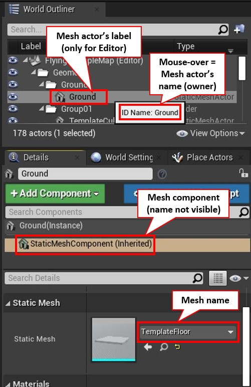
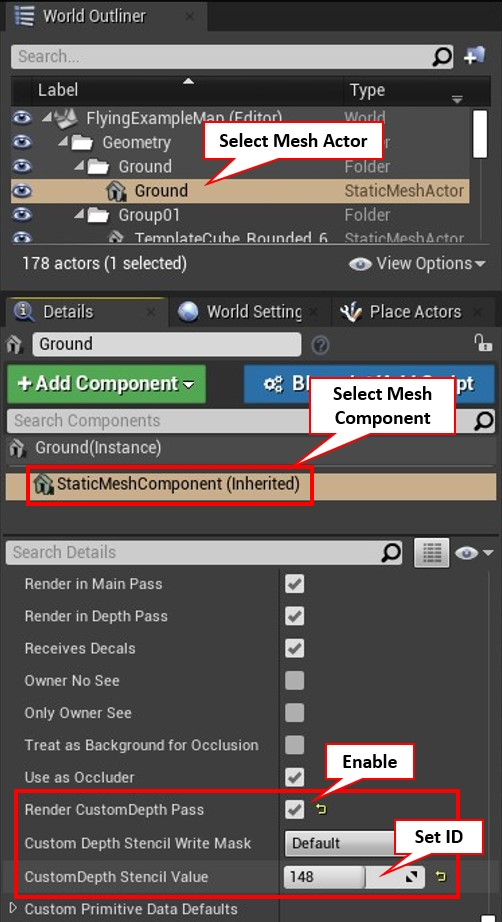
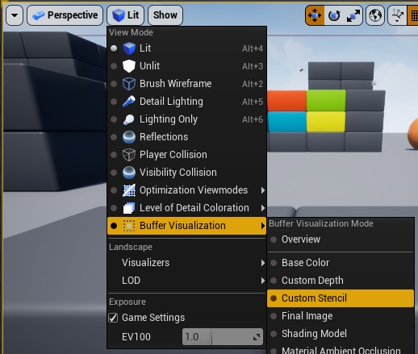
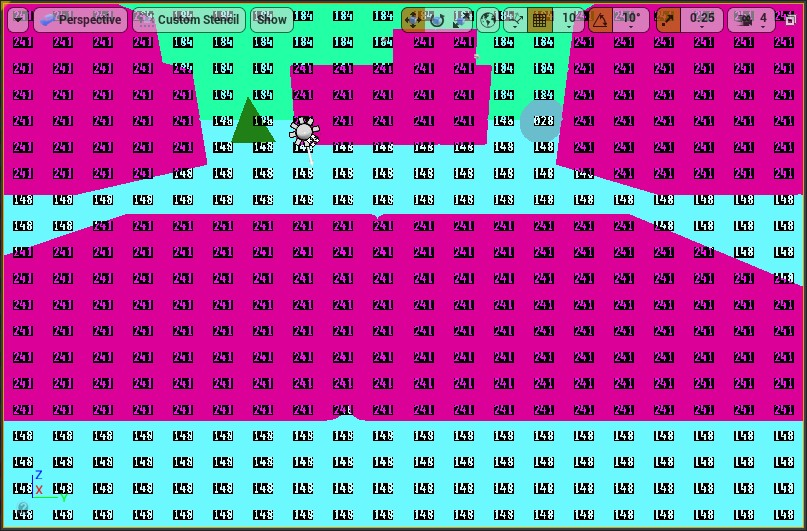

# Segmentation

## Mesh names for automatically initializing IDs

If using Project AirSim's automatic segmentation ID initialization (**[segmentation config setting](../config_scene.md#segmentation-settings)** `initialize-ids` set to `true`), the mesh names will be used for calculating the hash to set the ID value. There are multiple names at each level of the actor hierarchy that contains the mesh, so an example for viewing the names in the Editor is explained below:

Example for `Ground` StaticMeshActor:
1. The name listed in the `World Outliner` is the **actor's label**. This is only a display name used by the Editor, and is **NOT used as a name** for segmentation ID hashing.
2. The name listed if you mouse-over the actor name is the **actor's name**, which is the **owner's name** for the mesh ("Ground").
3. In the `Details` tab component list for the actor, the `StaticMeshComponent` is shown and can be selected to see its details, but the **name of the mesh component is not visible in the Editor** ("StaticMeshComponent0").
4. In the mesh component's details, the actual `StaticMesh` is shown with the **mesh's name** ("TemplateFloor").

*Note: Changing the actor's name using the field at the top of the `Detail` section applies the change to both #1 and #2 names described above.*

If the **[segmentation config setting](../config_scene.md#segmentation-settings)** for `use-owner-name` is `true`, the **#2 owner's name** will be used for the ID hashing. If `false`, the **#4 mesh's name** will be used.



## Assigning segmentation IDs in Unreal Editor

To set the segmentation IDs manually in the Unreal Editor (and be able to save them to persist in the environment), select the actor to modify in the `World Outliner` list. Next, select the mesh component in the `Details` tab and scroll down to the `Rendering` setting to enable `Render CustomDepth Pass`. Once enabled, the ID value can be set in `CustomDepth Stencil Value`.



A global setting must also be activated to enable all CustomDepth rendering, which can be done by running the console command (open console with tilde key):

```
r.CustomDepth 3
```

Alternatively, this setting can be enabled in `Project Settings` under `Engine - Rendering` -> `Postprocessing` -> `Custom Depth-Stencil Pass` set to `Enabled with Stencil`.

Once this feature is enabled and the objects are assigned IDs, you can visualize the segmentation in the viewport by changing the view from `Lit` to `Buffer Visualization` -> `Custom Stencil`.



If everything is set properly, the view will be colored by the ID groupings and the ID labels will be visible.

*Note: the color pallet Unreal uses is different from the Project AirSim **[segmentation color pallet](#segmentation-pallet)**.*



## Segmentation Pallet

The segmentation camera's image has pixels with RGB values specified based on each object's segmentation ID, using the fixed pallet below.

```
SegmentationID [R, G, B]

  0 [55, 181, 57]
  1 [153, 108, 6]
  2 [112, 105, 191]
  3 [89, 121, 72]
  4 [190, 225, 64]
  5 [206, 190, 59]
  6 [81, 13, 36]
  7 [115, 176, 195]
  8 [161, 171, 27]
  9 [135, 169, 180]
 10 [29, 26, 199]
 11 [102, 16, 239]
 12 [242, 107, 146]
 13 [156, 198, 23]
 14 [49, 89, 160]
 15 [68, 218, 116]
 16 [11, 236, 9]
 17 [196, 30, 8]
 18 [121, 67, 28]
 19 [0, 53, 65]
 20 [146, 52, 70]
 21 [226, 149, 143]
 22 [151, 126, 171]
 23 [194, 39, 7]
 24 [205, 120, 161]
 25 [212, 51, 60]
 26 [211, 80, 208]
 27 [189, 135, 188]
 28 [54, 72, 205]
 29 [103, 252, 157]
 30 [124, 21, 123]
 31 [19, 132, 69]
 32 [195, 237, 132]
 33 [94, 253, 175]
 34 [182, 251, 87]
 35 [90, 162, 242]
 36 [199, 29, 1]
 37 [254, 12, 229]
 38 [35, 196, 244]
 39 [220, 163, 49]
 40 [86, 254, 214]
 41 [152, 3, 129]
 42 [92, 31, 106]
 43 [207, 229, 90]
 44 [125, 75, 48]
 45 [98, 55, 74]
 46 [126, 129, 238]
 47 [222, 153, 109]
 48 [85, 152, 34]
 49 [173, 69, 31]
 50 [37, 128, 125]
 51 [58, 19, 33]
 52 [134, 57, 119]
 53 [218, 124, 115]
 54 [120, 0, 200]
 55 [225, 131, 92]
 56 [246, 90, 16]
 57 [51, 155, 241]
 58 [202, 97, 155]
 59 [184, 145, 182]
 60 [96, 232, 44]
 61 [133, 244, 133]
 62 [180, 191, 29]
 63 [1, 222, 192]
 64 [99, 242, 104]
 65 [91, 168, 219]
 66 [65, 54, 217]
 67 [148, 66, 130]
 68 [203, 102, 204]
 69 [216, 78, 75]
 70 [234, 20, 250]
 71 [109, 206, 24]
 72 [164, 194, 17]
 73 [157, 23, 236]
 74 [158, 114, 88]
 75 [245, 22, 110]
 76 [67, 17, 35]
 77 [181, 213, 93]
 78 [170, 179, 42]
 79 [52, 187, 148]
 80 [247, 200, 111]
 81 [25, 62, 174]
 82 [100, 25, 240]
 83 [191, 195, 144]
 84 [252, 36, 67]
 85 [241, 77, 149]
 86 [237, 33, 141]
 87 [119, 230, 85]
 88 [28, 34, 108]
 89 [78, 98, 254]
 90 [114, 161, 30]
 91 [75, 50, 243]
 92 [66, 226, 253]
 93 [46, 104, 76]
 94 [8, 234, 216]
 95 [15, 241, 102]
 96 [93, 14, 71]
 97 [192, 255, 193]
 98 [253, 41, 164]
 99 [24, 175, 120]
100 [185, 243, 231]
101 [169, 233, 97]
102 [243, 215, 145]
103 [72, 137, 21]
104 [160, 113, 101]
105 [214, 92, 13]
106 [167, 140, 147]
107 [101, 109, 181]
108 [53, 118, 126]
109 [3, 177, 32]
110 [40, 63, 99]
111 [186, 139, 153]
112 [88, 207, 100]
113 [71, 146, 227]
114 [236, 38, 187]
115 [215, 4, 215]
116 [18, 211, 66]
117 [113, 49, 134]
118 [47, 42, 63]
119 [219, 103, 127]
120 [57, 240, 137]
121 [227, 133, 211]
122 [145, 71, 201]
123 [217, 173, 183]
124 [250, 40, 113]
125 [208, 125, 68]
126 [224, 186, 249]
127 [69, 148, 46]
128 [239, 85, 20]
129 [108, 116, 224]
130 [56, 214, 26]
131 [179, 147, 43]
132 [48, 188, 172]
133 [221, 83, 47]
134 [155, 166, 218]
135 [62, 217, 189]
136 [198, 180, 122]
137 [201, 144, 169]
138 [132, 2, 14]
139 [128, 189, 114]
140 [163, 227, 112]
141 [45, 157, 177]
142 [64, 86, 142]
143 [118, 193, 163]
144 [14, 32, 79]
145 [200, 45, 170]
146 [74, 81, 2]
147 [59, 37, 212]
148 [73, 35, 225]
149 [95, 224, 39]
150 [84, 170, 220]
151 [159, 58, 173]
152 [17, 91, 237]
153 [31, 95, 84]
154 [34, 201, 248]
155 [63, 73, 209]
156 [129, 235, 107]
157 [231, 115, 40]
158 [36, 74, 95]
159 [238, 228, 154]
160 [61, 212, 54]
161 [13, 94, 165]
162 [141, 174, 0]
163 [140, 167, 255]
164 [117, 93, 91]
165 [183, 10, 186]
166 [165, 28, 61]
167 [144, 238, 194]
168 [12, 158, 41]
169 [76, 110, 234]
170 [150, 9, 121]
171 [142, 1, 246]
172 [230, 136, 198]
173 [5, 60, 233]
174 [232, 250, 80]
175 [143, 112, 56]
176 [187, 70, 156]
177 [2, 185, 62]
178 [138, 223, 226]
179 [122, 183, 222]
180 [166, 245, 3]
181 [175, 6, 140]
182 [240, 59, 210]
183 [248, 44, 10]
184 [83, 82, 52]
185 [223, 248, 167]
186 [87, 15, 150]
187 [111, 178, 117]
188 [197, 84, 22]
189 [235, 208, 124]
190 [9, 76, 45]
191 [176, 24, 50]
192 [154, 159, 251]
193 [149, 111, 207]
194 [168, 231, 15]
195 [209, 247, 202]
196 [80, 205, 152]
197 [178, 221, 213]
198 [27, 8, 38]
199 [244, 117, 51]
200 [107, 68, 190]
201 [23, 199, 139]
202 [171, 88, 168]
203 [136, 202, 58]
204 [6, 46, 86]
205 [105, 127, 176]
206 [174, 249, 197]
207 [172, 172, 138]
208 [228, 142, 81]
209 [7, 204, 185]
210 [22, 61, 247]
211 [233, 100, 78]
212 [127, 65, 105]
213 [33, 87, 158]
214 [139, 156, 252]
215 [42, 7, 136]
216 [20, 99, 179]
217 [79, 150, 223]
218 [131, 182, 184]
219 [110, 123, 37]
220 [60, 138, 96]
221 [210, 96, 94]
222 [123, 48, 18]
223 [137, 197, 162]
224 [188, 18, 5]
225 [39, 219, 151]
226 [204, 143, 135]
227 [249, 79, 73]
228 [77, 64, 178]
229 [41, 246, 77]
230 [16, 154, 4]
231 [116, 134, 19]
232 [4, 122, 235]
233 [177, 106, 230]
234 [21, 119, 12]
235 [104, 5, 98]
236 [50, 130, 53]
237 [30, 192, 25]
238 [26, 165, 166]
239 [10, 160, 82]
240 [106, 43, 131]
241 [44, 216, 103]
242 [255, 101, 221]
243 [32, 151, 196]
244 [213, 220, 89]
245 [70, 209, 228]
246 [97, 184, 83]
247 [82, 239, 232]
248 [251, 164, 128]
249 [193, 11, 245]
250 [38, 27, 159]
251 [229, 141, 203]
252 [130, 56, 55]
253 [147, 210, 11]
254 [162, 203, 118]
255 [43, 47, 206]
```

---

Copyright (C) Microsoft Corporation.  
Copyright (C) 2025 IAMAI Consulting Corp.

MIT License. All rights reserved.
